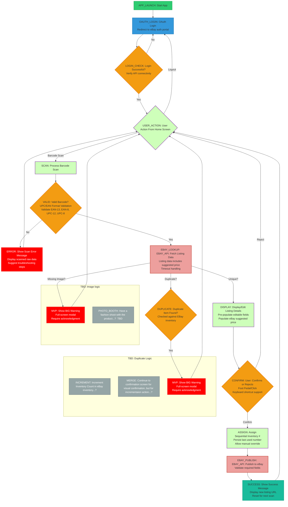
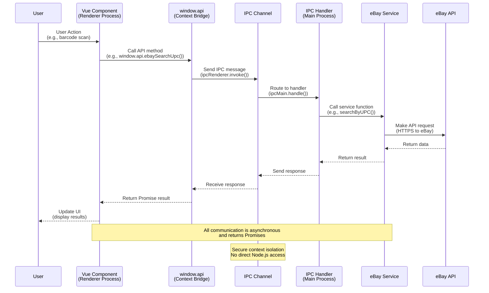

# eBay Listing Assistant

A modern Electron application built with Vue 3 and TypeScript for streamlined eBay listing creation from physical products using barcode scanning.

## Overview

This desktop application provides an efficient workflow for creating eBay listings by scanning product barcodes (UPC/EAN). It integrates with eBay's APIs to automatically fetch product details, validate inventory, and publish listings with proper policies and pricing.

## TODO

- \*\* Make listing title dropdown to switch info in listing preview...?
- \*\* Validate the UPC with agianst known products to make the multi listings not appear
- \*\* Loading pulsing animation so user knows when listing or searching.
- \*\* Make surte UPC field gets re selected after each action.
- \*\* Show updated sku on listing preview
- \*\* Incrementing inventory on sku, and giving a warning for sku non-incrementation
- \*\*

## Key Features

- **OAuth Authentication**: Secure eBay OAuth 2.0 integration with proper permission scopes
- **Barcode Processing**: UPC/EAN validation and processing for product identification
- **eBay Catalog Integration**: Automatic lookup of product details, pricing, and images
- **Duplicate Detection**: Checks existing eBay inventory to prevent duplicate listings
- **Smart Listing Management**: Pre-populated forms with eBay-suggested pricing and editable fields
- **Inventory Assignment**: Automatic sequential SKU assignment with manual override
- **Policy Management**: Configurable eBay selling policies (payment, return, fulfillment)
- **Publishing**: Direct publishing to eBay with validation and error handling
- **Comprehensive Logging**: File-based logging for debugging and audit trails

## Technology Stack

### Core Technologies

- **Electron 38.1.2**: Cross-platform desktop application framework
- **Vue 3.5.21**: Progressive JavaScript framework for the UI
- **TypeScript 5.9.2**: Type-safe JavaScript development
- **Vite 7.1.6**: Fast build tool and development server

### Development Tools

- **ESLint 9.36.0**: Code linting and quality enforcement
- **Vitest**: Unit testing framework
- **Electron-Vite**: Electron integration for Vite
- **Prettier**: Code formatting

### eBay Integration

- **eBay Browse API v1.20.4**: Product catalog and search functionality
- **eBay Sell Inventory API**: Inventory and offer management
- **eBay Sell Account API**: Policy management
- **OAuth 2.0**: Secure authentication flow

## Project Outline



## Functionality

This Electron application provides a streamlined workflow for creating eBay listings from physical products using barcode scanning. Key features include:

- **OAuth Authentication**: Secure login to eBay with proper permission scopes for catalog access and inventory management
- **Barcode Processing**: UPC/EAN validation and processing for product identification
- **eBay Catalog Integration**: Automatic lookup of product details, pricing, and images from eBay's catalog
- **Duplicate Detection**: Checks existing eBay inventory to prevent duplicate listings
- **Listing Management**: Pre-populated listing forms with eBay-suggested pricing and editable fields
- **Inventory Assignment**: Automatic sequential inventory number assignment with manual override
- **Publishing**: Direct publishing to eBay with validation and error handling
- **Logging**: Comprehensive logging to file for debugging and audit trails

## Authentication and Security

### Logout Handling

The application provides a secure logout mechanism that:

- Clears all stored OAuth tokens from local storage
- Revokes eBay API permissions if supported
- Redirects the user back to the login screen
- Ensures no residual session data remains

### Token Expiration Handling

To maintain continuous API access, the application implements:

- Automatic token refresh before expiration
- Proactive token validation before API calls
- Graceful handling of expired tokens with re-authentication prompts
- Secure token storage with encryption
- Logging of token-related events for debugging

## Required Libraries

### Runtime Dependencies

- **@electron-toolkit/preload**: Electron preload script utilities
- **@electron-toolkit/utils**: Electron development utilities
- **electron-updater**: Auto-update functionality for Electron apps
- **https-localhost**: HTTPS development server with local certificates

### Development Dependencies

- **electron**: Cross-platform desktop app framework
- **vue**: Progressive JavaScript framework for the UI
- **typescript**: Typed JavaScript for better code quality
- **vite**: Fast build tool and development server
- **vitest**: Testing framework
- **electron-vite**: Vite integration for Electron
- **eslint**: Code linting and formatting
- **prettier**: Code formatting

## Application Workflow

The application follows a streamlined barcode-driven workflow:

### 1. Authentication

- User initiates OAuth login with eBay
- Application redirects to eBay's OAuth portal
- User grants permissions for catalog access and inventory management
- Application receives and stores access token

### 2. Barcode Processing

- User scans or manually enters UPC/EAN barcode
- Application validates barcode format (EAN-13, EAN-8, UPC-12, UPC-8)
- Invalid barcodes show error messages with troubleshooting suggestions

### 3. Product Lookup

- Valid barcodes trigger automatic eBay catalog search
- Application fetches product details, pricing, images, and specifications
- Results include eBay's suggested pricing and category information

### 4. Duplicate Detection

- System checks existing eBay inventory for potential duplicates
- Duplicate items trigger prominent warnings requiring user acknowledgment
- Users can choose to continue or cancel the listing process

### 5. Listing Preparation

- Product information is displayed in an editable form
- Pre-populated fields include title, price, condition, and category
- Users can modify any details before publishing

### 6. Inventory Assignment

- Application automatically assigns sequential SKU numbers
- Users can override with custom SKU if needed
- SKU counter persists between sessions

### 7. Publishing

- Application creates inventory item via eBay's Inventory API
- Creates and publishes offer with configured policies
- Validates all required fields before submission

### 8. Confirmation

- Success message displays with new listing URL
- Application logs all actions for audit trails
- Ready for next barcode scan

## Configuration

### eBay Policies Setup

Before creating listings, configure your eBay selling policies:

1. **Payment Policies**: Define accepted payment methods
2. **Return Policies**: Set return windows and conditions
3. **Fulfillment Policies**: Configure shipping settings

Policies are configured once and reused for all listings.

### Application Settings

The application supports customization through `app.properties`:

```properties
# Shipping Configuration
SHIPPING.DEFAULT_COST=4.99
SHIPPING.DEFAULT_CURRENCY=USD
SHIPPING.DEFAULT_TYPE=FIXED

# Pricing Configuration
PRICING.MARKUP_PERCENTAGE=15.0
PRICING.MINIMUM_PROFIT_MARGIN=2.00

# Listing Configuration
LISTING.DEFAULT_QUANTITY=1
LISTING.DEFAULT_CONDITION=Very Good
LISTING.AUTO_PUBLISH=false
```

## Troubleshooting

### Common Issues

#### OAuth Authentication Issues

- **Problem**: "OAuth window closed" error
- **Solution**: Ensure redirect URI matches eBay application settings
- **Check**: Verify `VITE_EBAY_REDIRECT_URI` in `.env` file

#### API Connection Issues

- **Problem**: "Network error" or API timeouts
- **Solution**: Check internet connection and eBay API status
- **Check**: Verify API credentials in `.env` file

#### Build Issues

- **Problem**: Build fails with linting errors
- **Solution**: Run `npm run lint:fix` to auto-fix issues
- **Check**: Ensure all dependencies are installed with `npm install`

#### Test Failures

- **Problem**: Tests fail unexpectedly
- **Solution**: Clear test cache and reinstall dependencies
- **Command**: `rm -rf node_modules && npm install`

### Logs and Debugging

The application maintains detailed logs in `eeeeee-bay.log`:

- **Location**: Project root directory
- **Format**: ISO timestamp with log level and message
- **Contents**: API calls, authentication events, errors, and user actions

Enable verbose logging by setting the `DEBUG` environment variable:

```bash
DEBUG=* npm run dev
```

### Performance Issues

- **Slow startup**: Clear Electron cache and node_modules
- **Memory usage**: Monitor with Chrome DevTools (F12)
- **API timeouts**: Increase timeout values in constants.ts

## Architecture

### Application Structure

```
src/
├── main/                 # Electron main process
│   ├── index.ts         # Application entry point
│   ├── ebayService.ts   # eBay API integration
│   ├── constants.ts     # Application configuration
│   └── userSettings.ts  # User preferences storage
├── preload/             # Electron preload scripts
│   └── index.ts        # Context bridge APIs
└── renderer/            # Vue.js renderer process
    ├── src/
    │   ├── App.vue     # Main application component
    │   ├── api.ts      # Frontend API calls
    │   └── components/ # Vue components
    └── vite.config.ts  # Vite configuration
```

### Security Model

- **Context Isolation**: Renderer processes cannot access Node.js APIs directly
- **Preload Scripts**: Safe API exposure through Electron's context bridge
- **OAuth Flow**: Secure token handling with proper storage
- **Certificate Validation**: Bypassed only during OAuth flow for compatibility

### Data Flow

1. **User Input** → Vue Components → IPC → Main Process
2. **API Calls** → eBay APIs → Data Processing → IPC → Vue Components
3. **Settings** → File System → User Settings Manager → Components

## Project Setup

### Prerequisites

Before setting up the project, ensure you have the following installed:

- **Node.js 18+**: Download from [nodejs.org](https://nodejs.org/)
- **npm or yarn**: Package manager (npm comes with Node.js)
- **eBay Developer Account**: Required for API access

### eBay Developer Account Setup

1. **Create eBay Developer Account**
   - Visit [developer.ebay.com](https://developer.ebay.com/)
   - Sign up for a developer account
   - Create a new application in the [Application Keys](https://developer.ebay.com/my/keys) section

2. **Configure Application**
   - **App ID (Client ID)**: Your application's unique identifier
   - **Cert ID (Client Secret)**: Secret key for server-side authentication
   - **Dev ID**: Developer account identifier
   - **RuName (Redirect URI)**: `https://localhost:3000/callback` (for OAuth)

3. **Set API Permissions**
   - Enable the following scopes in your application settings:
     - `https://api.ebay.com/oauth/api_scope` (Browse API)
     - `https://api.ebay.com/oauth/api_scope/sell.inventory` (Inventory API)
     - `https://api.ebay.com/oauth/api_scope/sell.account` (Account API)

### Installation

1. **Clone the repository**

   ```bash
   git clone <repository-url>
   cd eeeeee-bay
   ```

2. **Install dependencies**

   ```bash
   npm install
   ```

3. **Environment Configuration**

   Create a `.env` file in the project root with your eBay API credentials:

   ```env
   # eBay API Configuration
   VITE_EBAY_APP_ID=your_app_id_here
   VITE_EBAY_CLIENT_ID=your_app_id_here
   VITE_EBAY_CLIENT_SECRET=your_cert_id_here
   VITE_EBAY_DEV_ID=your_dev_id_here
   VITE_EBAY_REDIRECT_URI=https://localhost:3000/callback

   # OAuth Configuration
   VITE_EBAY_SCOPE=https://api.ebay.com/oauth/api_scope https://api.ebay.com/oauth/api_scope/sell.inventory https://api.ebay.com/oauth/api_scope/sell.account

   # Environment Settings
   VITE_EBAY_SANDBOX=false  # Set to true for sandbox testing
   ```

4. **Verify Installation**
   ```bash
   npm run typecheck
   npm run lint
   npm run test
   ```

### Development

Start the development server with hot reload:

```bash
npm run dev
```

The application will open automatically. The development server includes:

- Hot module replacement for instant updates
- Vue DevTools integration
- Electron DevTools access (F12)

### Building for Production

Build the application for your target platform:

```bash
# Universal build (includes lint, test, and typecheck)
npm run build

# Platform-specific builds
npm run build:win    # Windows
npm run build:mac    # macOS
npm run build:linux  # Linux
```

The built application will be available in the `out` directory.

### Testing

Run the test suite:

```bash
# Run all tests
npm run test

# Run tests in watch mode
npm run test:watch

# Run tests with coverage
npm run test:coverage
```

### Code Quality

The project includes automated code quality checks:

```bash
# Lint code
npm run lint

# Fix linting issues automatically
npm run lint:fix

# Type checking
npm run typecheck

# Format code
npm run format
```

### Development Scripts

| Command             | Description                          |
| ------------------- | ------------------------------------ |
| `npm run dev`       | Start development server             |
| `npm run build`     | Production build with quality checks |
| `npm run lint`      | Run ESLint                           |
| `npm run test`      | Run Vitest                           |
| `npm run typecheck` | Run TypeScript type checking         |
| `npm run format`    | Format code with Prettier            |

## Development Status

### ✅ **Completed Features**

- [x] **OAuth Authentication Setup**
  - [x] eBay OAuth 2.0 integration with proper scopes
  - [x] Token storage and refresh handling
  - [x] API connectivity verification

- [x] **eBay API Integration**
  - [x] Browse API v1.20.4 for product catalog access
  - [x] Sell Inventory API for listing management
  - [x] Sell Account API for policy management
  - [x] OpenAPI-generated client libraries

- [x] **Core Application Features**
  - [x] Vue 3 Composition API with TypeScript
  - [x] UPC/EAN barcode validation and processing
  - [x] Product lookup with automatic data population
  - [x] Duplicate inventory detection
  - [x] Sequential SKU assignment with persistence
  - [x] eBay policy configuration (payment, return, fulfillment)
  - [x] Listing creation and publishing workflow

- [x] **User Interface**
  - [x] Modern Vue 3 component architecture
  - [x] Responsive design with Tailwind CSS
  - [x] Comprehensive form validation
  - [x] Real-time logging and status updates

- [x] **Quality Assurance**
  - [x] ESLint configuration with Vue 3 support
  - [x] Vitest unit testing framework
  - [x] TypeScript strict mode enabled
  - [x] Automated build pipeline with quality gates

- [x] **Build & Deployment**
  - [x] Electron-Vite build system
  - [x] Cross-platform builds (Windows, macOS, Linux)
  - [x] Auto-update functionality with electron-updater

### 🔄 **Current Status**

- [x] **MVP Release Ready**: Core barcode-to-listing workflow functional
- [x] **Production Build**: Successfully builds and packages for distribution
- [x] **Documentation**: Comprehensive setup and usage guides
- [x] **Testing**: Unit test coverage for critical paths

### 📋 **Future Enhancements (Post-MVP)**

- [ ] **Hardware Integration**
  - [ ] Barcode scanner hardware support
  - [ ] Foot pedal input for hands-free operation
  - [ ] Photo booth integration for product photography

- [ ] **Advanced Features**
  - [ ] Bulk listing operations
  - [ ] Custom listing templates
  - [ ] Advanced duplicate handling (increment vs merge)
  - [ ] Analytics and reporting dashboard

- [ ] **Developer Experience**
  - [ ] CI/CD pipeline setup
  - [ ] Automated testing infrastructure
  - [ ] Performance monitoring and optimization

## API Reference

### Application Communication Flow



### Main Process APIs

#### eBay Service Functions

```typescript
// Initialize eBay API client
initializeEbayApi(config: EbayConfig): void

// OAuth token management
setAccessToken(token: string): void
exchangeCodeForToken(code: string, redirectUri: string, clientId: string, clientSecret: string, sandbox: boolean): Promise<string>

// Product operations
searchByUPC(upc: string): Promise<Product | null>
checkForDuplicate(upc: string): Promise<boolean>

// Inventory management
getInventoryItems(limit?: number): Promise<InventoryItem[]>
createInventoryItem(sku: string, itemData: object): Promise<any>
createOffer(offerData: object): Promise<any>
publishOffer(offerId: string): Promise<any>

// Policy management
getFulfillmentPolicies(marketplaceId?: string): Promise<Policy[]>
getPaymentPolicies(marketplaceId?: string): Promise<Policy[]>
getReturnPolicies(marketplaceId?: string): Promise<Policy[]>

// Utilities
getNextSku(): Promise<string>
logout(): void
```

#### IPC Handlers

```typescript
// OAuth
ipcMain.handle('oauth-login', handler)

// eBay API operations
ipcMain.handle('ebay-init', handler)
ipcMain.handle('ebay-set-token', handler)
ipcMain.handle('ebay-search-upc', handler)
ipcMain.handle('ebay-check-duplicate', handler)
// ... additional handlers
```

### Renderer Process APIs

```typescript
// Available via window.api
interface Window {
  api: {
    // OAuth
    oauthLogin(
      authUrl: string,
      redirectUri: string,
      clientId: string,
      clientSecret: string,
      sandbox: boolean
    ): Promise<string>

    // eBay operations
    ebayInit(config: EbayConfig): Promise<Result>
    ebaySetToken(token: string): Promise<Result>
    ebaySearchUpc(upc: string): Promise<Result>
    ebayCheckDuplicate(upc: string): Promise<Result>
    // ... additional methods
  }
}
```

## Contributing

### Code Standards

- **TypeScript**: Strict mode enabled, no `any` types without justification
- **Vue 3**: Composition API preferred, proper TypeScript integration
- **ESLint**: All linting rules must pass
- **Testing**: Unit tests required for new features
- **Documentation**: JSDoc comments for public APIs

### Development Workflow

1. **Branch**: Create feature branch from `main`
2. **Develop**: Implement changes with tests
3. **Quality**: Run `npm run build` to ensure all checks pass
4. **Commit**: Use descriptive commit messages
5. **PR**: Create pull request with detailed description

### Testing Guidelines

- **Unit Tests**: Cover business logic and utilities
- **Component Tests**: Test Vue component behavior
- **Integration Tests**: API integration and IPC communication
- **E2E Tests**: Complete user workflows (future)

## License

This project is proprietary software. All rights reserved.
